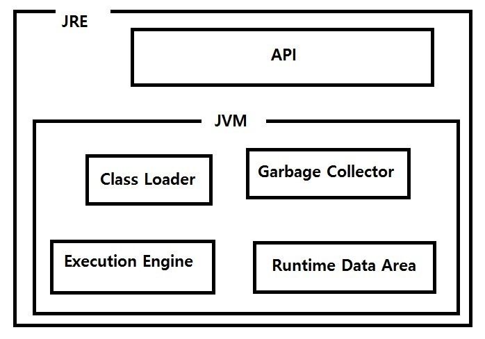

# JVM

---

**JVM**이란 **자바 프로그램 실행환경**을 만들어주는 소프트웨어다

-> 컴파일러를 통해 바이트코드(.class)로 변환하고 그 파일을 JVM에 로딩하여 실행한다.

> Java는 어떠한 플랫폼에 영향을 받지 않는다.

JVM을 사용함으로써 얻는 가장 큰 이점은 하나의 바이트코드로 모든 플랫폼에서 동작하게 할 수 있다.

>.class 파일은 바이트코드라고 하는 사람이 쓰는 자바코드에서 컴퓨터가 읽는 기계어로의 중간 단계라고 생각하면 편하다.

Java언어로 작성된 Example.java는 컴파일하면 Example.class 파일이 생성되고 

이 바이트코드는 각자의 플랫폼에 설치되어 있는 JVM이 운영체제에 맞는 실행파일로 바꿔준다.

## Java는 플랫폼에 종속적이지 않지만 JVM은?

---

Java는 컴파일된 바이트코드로 어떤 JVM에서도 동작시킬 수 있기 때문에 플랫폼에 의존적이지 않다. 하지만

JVM은 플랫폼에 의존적이다 그 이유를 알아보자

1. 하드웨어 및 운영체제 추상화 : JVM은 Java 프로그램이 여러 플랫폼에서 동작할 수 있도록 하드웨어와 운영체제를 추상화 하는 역할을 한다. 이 추상화를 가능하게 하기 위해서는 JVM 자체가 특정 플랫폼에 맞게 설계되어야 한다.

2. 최적화 및 효율성 : JVM은 특정 운영체제와 하드웨어에서 최상의 성능을 제공하기 위해 최적화 되어야한다. 이러한 최적화는 플랫폼 특성에 따라 다르기 때문에 JVM도 플랫폼에 맞게 구현되어야 한다.

3. 시스템 리소스 접근 : JVM은 운영체제의 리소스나 하드웨어 리소스에 접근해야 할 때가 있다. 파일시스템, 네트워크 등이 있다. 이러한 리소스는 접근하는 방법으 다르므로 JVM은 해당 플랫폼에 맞게 동작해야 한다.

4. 네이티브 메서드 호출 : Java에서는 JNI(Java Native Interface)와 같은 기술을 통해 네이티브 코드와 상호작용할 수 있다. 이런 네이티브 메서드 호출은 플랫폼에 따라 다르기 때문에 JVM이 이를 지원하기 위해서는 플랫폼에 종속적이어야 한다.

## JVM의 구조

---

Class Loader :

JVM 내의 Runtime Data Area로 바이트코드(.class)를 로딩한다.

Execution Engine :

Runtime Data Area에 있는 바이트코드를 기계어로 번역하여 실행한다. 실행 방식은 크게 두가지가 있다.

1. Interpreter 방식 : 초기에 사용하던 방식으로 바이트코드를 한 줄씩 해석해서 실행, 속도가 느리다

2. JIT(Just In Time) 컴파일 or 동적 번역 : 바이트코드를 JIT 컴파일러를 이용해 프로그램을 **실제 실행하는 시점(바이트 코드를 실행하는 시점)에 각 OS에 맞는 Native Code로 변환**하여 실행 속도를 개선한다. 하지만, 바이트코드를 Native Code로 **변환하는 데에도 비용이 들기때문에**, JVM은 모든 코드를 JIT 컴파일러 방식으로 실행하지 않고, **인터프리터 방식을 사용하다 일정 기준이 넘어가면 JIT 컴파일 방식**으로 명령어를 실행한다.
 또한 JIT 컴파일러는 같은 코드를 매번 해석하지 않고, 실행할 때 컴파일을 하면서 해당 코드를 캐싱한다. 이후에는 바뀐 부분만 컴파일하고, 나머지는 캐싱된 코드를 재사용한다.

Garbage Collector :

Heap 메모리 영역에 생성된 객체들 중 **참조가 끊긴 객체들을 찾아 제거하는 역할**

하지만 GC가 작동하는 시간은 확실히 알 수 없다.(참조가 끊기자마자 GC가 제거해주는 것을 보장해주지 않는다)

GC가 동작하는 동안 GC가 사용하는 쓰레드를 제외하고는 모두 멈춘다 (stop-the-world)

Runtime Data Area  :

JVM의 메모리 영역으로 자바 어플리케이션을 실행할 때 사용되는 데이터를 Load하는 영역이다.

