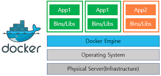

## 도커의 동작 원리

### 도커의 구조

일반적으로 `도커`와 `컨테이너`는 서버에서 사용된다.

우선 물리 서버가 있고, 물리 서버에서 동작하는 리눅스 운영체제가 있다. 여기까지는 일반적인 서버와 다를 바 없다.

일반적인 서버라면 운영체제 위에 프로그램이나 데이터가 직접 올라가겠지만

도커를 사용하는 경우에는 **운영체제 위에 도커 엔진이 동작하고 그 위에서 컨테이너가 동작**한다.

### 컨테이너 안에는 운영체제 비슷한 것이 들어있다.

**모든 컨테이너에는 리눅스 운영체제 비슷한 무언가가 들어있다**.

`빈 컨테이너`라고 했지만 정말로 텅 빈 것은 아니다.

여기서 말하는 `리눅스 운영체제 비슷한 무언가`는 무엇을 의미할까?

### 운영체제가 하는 일

`운영체제`는 **소프트웨어나 프로그램의 명령을 하드웨어에 전달하는 역할**을 한다.

`하드웨어`는 자신의 판단으로 여러 의미 중 적절한 것을 고르거나 적당히 일을 할 수 없고,

지시받은 대로만 수행할 수 있기 때문에 **세세한 동작 하나하나를 지정해주지 않으면 안된다**.

그렇기 때문에 `운영체제`가 명령을 번역해 `하드웨어`에 전달한다.

 

위에서 말했던 것 처럼 **도커 엔진 아래에도 리눅스 운영체제가 있는데, 컨테이너 속에 또 리눅스 운영체제(비슷한 것)가 있다**고 했다.

기묘한 구조지만 이는 도커의 가장 큰 특징 중 하나다.

본래 `운영체제`는 `커널`이라는 부분과 `그 외의 주변 부분`으로 구성된다.

`주변 부분`이 **프로그램의 연락 내용을 커널에 전달**하고 `커널`이 **하드웨어를 다룬다**.

> 주변 부분은 프로그램에서 명령을 전달받거나 커널이 실행한 결과를 프로그램에 다시 전달하는 역할을 한다.
> 키보드로 입력한 내용을 전달받고 모니터에 데이터를 출력하는 것이 이러한 예다.

`도커`는 컨테이너가 **완전히 분리**되어 있으므로 **밑바탕이 되는 리눅스 운영체제의 주변 부분**이 컨테이너 속 프로그램의 명령을 전달받을 수 없다.

따라서 컨테이너 속에 **운영체제의 주변 부분**이 들어있어 프로그램의 명령을 전달받고 이를 밑바탕이 되는 커널에 전달하는 구조로 돼 있다.

위에서 말한 `컨테이너` 속 **운영체제 비슷한 것**이 들어 있는 것은 이 때문이다. 전체 리눅스 운영체제가 들어있는 것이 아니라 **주변 부분**만 들어 있기 때문에 `비슷한 것`이라고 표한하는 것이다.

이러한 형태 덕분에 **도커의 가장 큰 특징**인 `가벼움`을 얻을 수 있다.

### 도커는 기본적으로 리눅스용이다.

`도커`는 기본적으로 **리눅스 운영체제**에서만 동작한다.

도커는 밑바탕에서 **리눅스 운영체제가 동작하는 것을 전제**로 하는 구조로 돼 있기 떄문에 리눅스 운영체제에서만 동작할 수있다.

또 컨테이너 안에 있는 **주변 부분**도 이에 맞게 **리눅스 운영체제의 주변 부분**이어야 한다.

컨테이너에서 실행할 소프트웨어(프로그램) 역시 리눅스용 소프트웨어다. 윈도우/mac OS용 소프트웨어는 컨테이너에 넣어도 동작하지 않는다.

즉, 도커는 리눅스 컴퓨터에 독립된 격리 환경을 만드는 것이며, 리눅스에서만 동작하고, 컨테이너에서 동작할 프로그램도 리눅스용 프로그램이다.

## 도커 허브와 이미지, 컨테이너

컨테이너를 생성하려면 먼저 `이미지를` 만들어야 한다.

이미지는 컨테이너를 찍어내는 `빵틀`과 같은 것으로 컨테이너 `설계도` 같은 역할을 한다.

이미지는 이미지 자체로는 큰 쓸모가 없다. **이미지는 컨테이너를 만드는데 사용**한다.

우리가 실제 사용하는 것은 컨테이너이며, 이미지를 그대로 사용하는 일은 없다.

### 컨테이너로도 이미지를 만들 수 있다.

이미지로만 컨테이너를 만들 수 있는 것이 아니라 **컨테이너로도 이미지를 만들 수 있다**.

컨테이너로 이미지를 만드는 것은 이미 만든 컨테이너에 손을 대서 컨테이너의 금형(설계도)을 새로이 만드는 과정이다.

### 다양한 형태로 조합이 가능한 컨테이너

도커를 사용할 때 원칙 중 하나로, `한 컨테이너에 한 프로그램`이라는 것이 있다.

말 그대로 하나의 프로그램만 담긴 컨테이너를 사용한다는 의미다.

보안 및 유지 관리 측면에서 유리하기 때문에 많이 쓰이는 정책이다.

## 도커 컨테이너의 생애주기와 데이터 저장

### 도커 컨테이너는 쓰고 버리는 일회용품

`컨테이너`는 쓰고 버리는 `일회용품`같은 것이다.

컨테이너는 **쉽게 만들 수 있기 때문에** 컨테이너를 하나하나를 업데이트하면서 사용하는 것이 아니라

업데이트된 소프트웨어가 들어있는 새로운 컨테이너를 사용하는 것이 좋다.

즉, 새로운 버전이 나오면 새로운 컨테이너로 갈아타는 것이다.

이것이 가능한 이유는 **컨테이너는 일반적으로 여러 개를 동시 가동하는 상황을 전제**로 하기 때문이다.

이렇듯 컨테이너를 `만들고`, `실행하고`, `종료하고`, `폐기한` 다음, **다시 새로운 컨테이너를 만드는 일련의 과정을**

**컨테이너의 생애주기**라고 부른다.

### 데이터 저장

컨테이너를 폐기하면 **해당 컨테이너 안에서 편집했던 파일은 당연히 사라진다**.

이런 일을 방지하기 위해 보통은 **도커가 설치된 물리적 서버(호스트)의 디스크를 마운트해** 이 디스크에 데이터를 저장한다.

`마운트`는 **디스크를 연결해 데이터를 기록할 수 있도록 한 상태**를 의미한다.

이런 방법으로 컨테이너가 폐기되더라도 데이터는 컨테이너 외부에 안전하게 저장되어 사라지지 않는다.

`일회용품 같은 컨테이너`의 개념은 운영체제나 소프트웨어 부분은 컨테이너 형태로 만들었다가 쓰고 버리는 것을 반복하고,

데이터는 다른 곳에 저장해두고 같은 것을 계속 사용한다고 보면 된다.

## 도커의 장점과 단점

### 환경을 격리할 수 있다는 것이 핵심

#### 독립된 환경

독립된 환경,덕분에 **여러 개의 컨테이너를 띄울 수** 있으며, **똑같은 애플리케이션도 여러 개 띄울 수**있다.

#### 이미지를 만들 수 있다.

이미지를 만들 수 있고, 만든 이지미를 **도커 허브에서 배포**할 수 있다.

모든 이미지를 스스로 처음부터 만들지 않아도 **이미지를 내려받기만 하면** 컨테이너 사용이 가능하다.

구축 작업이 간단해지므로 `교체가 쉽고`, `업데이트가 쉬운` 장점이 있다.

#### 컨테이너에 커널을 포함시킬 필요가 없다.

컨테이너에 커널(운영체제의 핵심이 되는 부분)을 포함시킬 필요가 없으므로 **가볍다**.

### 도커의 장점

#### 한 대의 물리 서버에 여러 대의 서버를 띄울 수 있다

첫 번째 장점은 한 대의 물리 서버에 여러 가지 기능을 **안전한 상태로 띄울 수 있다는 점이다**.

여러 가지 기능을 띄우는 것 자체는 일반적인 서버로도 가능하지만 도커는 **격리된 환경**을 제공하므로

이들이 각각 안전한 상태로 실행된다.

#### 서버 관리가 용이하다

컨테이너를 이용해 각 소프트웨어를 독립된 환경에 격리하므로 다른 소프트웨어에 영향을 끼치지 않는다.

이 덕분에 항상 최신 상태로 스프트웨어를 유지하기 쉬운 구조가 된다.

컨테이너 교체나 수정이 쉬으므로 환경 이전도 간단하다.

### 도커의 단점

**`리눅스 운영체제`를 사용하는 기술**이므로 리눅스용 소프트웨어밖에 지원하지 않는다.

물리 서버 한 대에 여러 대의 서버를 띄우는 형태이므로 **호스트 서버에 문제가 생기면 모든 컨테이너에 영향이 미친다**.

`컨테이너`를 여러 개 사용하는 형태를 가정하므로 컨테이너 하나를 장기간에 걸쳐 사용할 때는 그리 큰 장점을 느끼기 어렵다.

도커를 사용하려면 반드시 `도커 엔진`을 구동해야 하는데, 컨테이너를 하나밖에 사용하지 않는다면

도커 엔진은 단순한 오버헤드에 지나지 않는다.