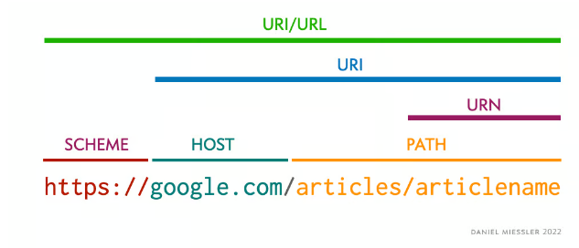

# URI(Uniform Resource Identifier)

URI 뜻은 우리말로 **통합 자원 식별자** 이다.

- Uniform : 리소스를 식별하는 통일된 방식
- Resource : URI로 식별이 가능한 모든 종류의 자원(웹 브라우저 파일 및 그 이외의 리소스 포함)
- Idenfitier : 다른 항목과 구분하기 위해 필요한 정보

즉, URI는 인터넷상의 리소스 **자원 자체**를 식별하는 고유한 문자열 시퀀스다.

# URL(Uniform Resource Locator)

URL은 **네트워크상에서 통합 자원(리소스)의 위치를 나타내기 위한 규약**이다.

즉, **자원 식별자와 위치**를 동시에 보여준다.

**특정 웹 페이지의 주소에 접속하기 위해서는 웹 사이트의 주소뿐만 아니라 프로토콜(https, http, sftp 등)을 함께
알아야 접속이 가능**한데 이들을 모두 나타내는 것이 URL이다. 

# URI vs URL

URI = 식별자, URL = 식별자 + 위치

example.co.kr는 URI이다. 리소스의 이름만 나타내기 때문이다

https://example.co.kr은 URL이다. 이름과 더불어 어떻게 도달할 수 있는지 위치까지 함께 나타내기 때문이다 (프로토콜 'https' 포함)

## URL은 일종의 URI이다.

URI이 더 포괄적인 개념이며, URL은 이 안에 포함된다.

## URL은 프로토콜과 결합한 형태이다

https://www.testr.co.kr -> URL

즉, 어떻게 위치를 찾고 도달할 수 있는지까지 포함되어야 하기 때문에 URL은 프로토콜 + 이름(또는 번호)의 형태여야 한다.

프토토콜이란, 리소스에 접근하는 방법을 지정하는 방식으로, 일반적으로 http, https, ftp 등이 해당할 수 있다.

## URI는 그 자체로 이름이 될 수 있다.

test.co.kr -> URI

https://www.test.co.kr -> URL, URI

URI는 그 자체로 **이름(test.co.kr)**이거나

**이름 + 위치(https://www.test.co.kr)**을 나타낸 형태 모두가 해당한다.

식별자 + 위치를 나타내는 URL은 URI의 일종이기 때문이다.

## URI URL 구조

- Scheme : 리소스에 접근하는데 사용할 프로토콜, 웹에서는 http, https
- Host : 접근할 대상(서버)의 호스트명
- Path : 접근할 대상(서버)의 경로에 대한 상세 정보

# URN

URN은 리소스의 위치, 프로토콜, 호스트 등과는 상관없이 각 자원에 이름을 부여한 것이다.

URL은 어떤 특정 서버에 있는 웹 문서를 가리키는 반면, URN은 웹 문서의 물리적인 위치와 상관없이 웹 문서 자체를 나타낸다.

