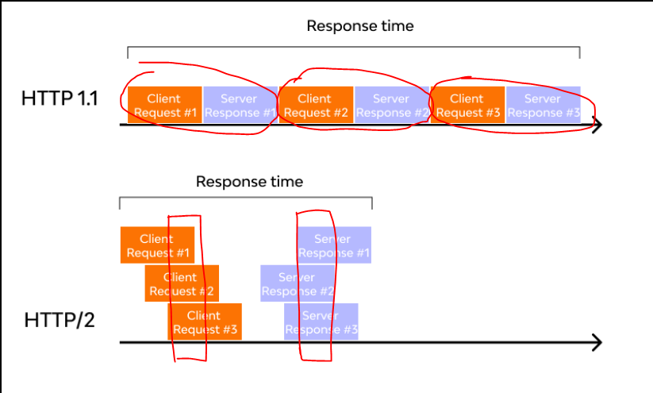
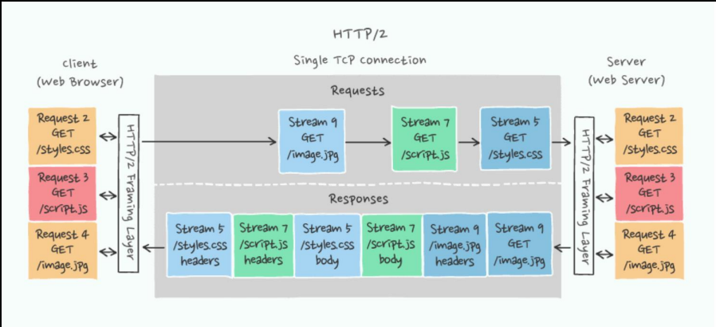
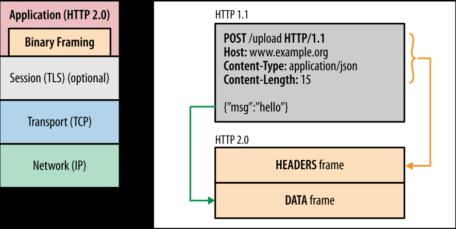
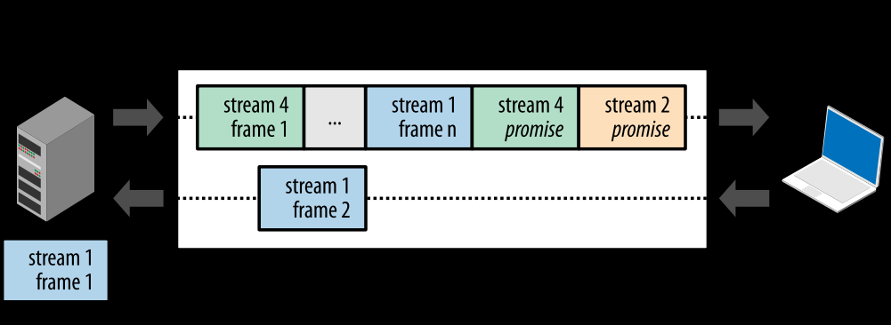
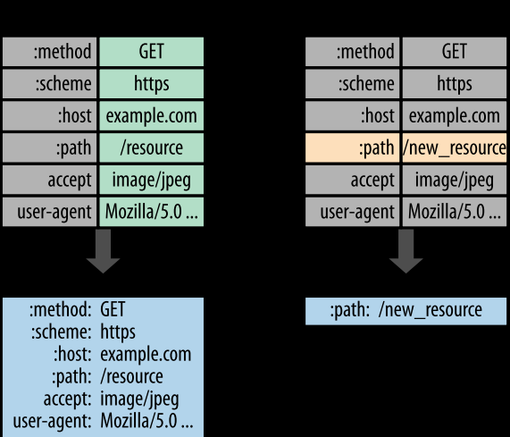

# HTTP/1.0

Client 가 있고, 웹버가 있다고 가정해보자.

기본적으로 TCP/IP 연결을 시도 하고, 그다음에 request를 하고 response를 받는다.

1.0 에서는 좀 무식하게 동작했는데 만약에 request가 3개가 있다면

TCP/IP 연결도 3번을 했다.

| TCP/IP 연결1. req1, res1 | TCP/IP 연결2. req2, res2 | TCP/IP 연결3. req3, res3 | ...

>HTTP/1.0은 **Connectionless**이기 때문이다.
>
>Connection: close 가 default

# HTTP/1.1 vs HTTP/2

HTTP/1.1의 주요 특징 중 하나는 **지속적인 연결**이다.

이는 여러 번의 요청과 응답을 하나의 TCP/IP 연결에서 처리할 수 있게 해준다.

하지만 HTTP/1.1에서는 기본적으로 한 번에 하나의 요청과 응답만 처리한다. 이를 **Head-of-Line blocking**이라 한다.

이는 아래 사진과 같이 한 번에 하나의 요청과 응답만 처리할 수 있으며, 이전 요청의 응답이 완료되어야 다음 요청의 응답이 시작된다.

>**Connection 유지**, Connection: keep-alive가 default

HTTP 2 에서는 한번에 n개의 데이터가 필요하다고 한번에 request를 보내고 서버에서는 데이터들을

중첩이 가능하도록 Frame 단위로 잘라서 동시에 보내버린다.

# HTTP 2

HTTP/1.1 과의 주요한 차이점은 요청/응답 cycle을 기다리지 않고

**하나의 connection에서 multiplexing 전송**이 가능하다는 점이다.

HTTP2 에서는 필요한 request들을 한번에 묶어 보낸다.

서버에서는 요청의 순서와 상관없이 전송가능한 데이터들을 먼저 보낸다.

## Binary frame & multiplexing

HTTP body 부분이 1.1에서는 text로 전송되었지만 **2.0에서는 binary frame 단위로 전송**된다.

기존에는 http header와 body가 \r\n 으로 구분되었으나 HTTP/2 부터는 header와 body가 layer로 구분된다
(이를 binary framing layer라고 부른다.)

이전에는 header-body를 묶은 http message가 전송 최소 단위였지만,

**2.0에서는 전송 최소 단위가 binary frame**이 된다.

2.0에서는 이렇게 binary frame 단위로 쪼개서 보내는 방식이기 때문에, 하나의 connection을 여러 stream이 이용할 수 있어
다중 전송(multiplexing)이 가능하다.

TLS (SSL) 

TCP/IP 소켓통신 내용을 암호화는 것인데 우리는 SSL 이라는 이름이 더 친숙하지만 TLS 라는 이름으로 바뀐지 꽤 되었다.

## 헤더 압축

HTTP 헤더가 text로 되어있는데, 중복되는 요소들이 굉장히 많다.

한번 request1이 가고, 두번째로 request2가 갔을 때 중복되는 요소는 보내지 않고 다른거만 보낸다면

중복요소 제거를 통해 최적화가 되고, 불필요한 네트워크 사용이 줄어들고 성능이 좋아지게 된다.

